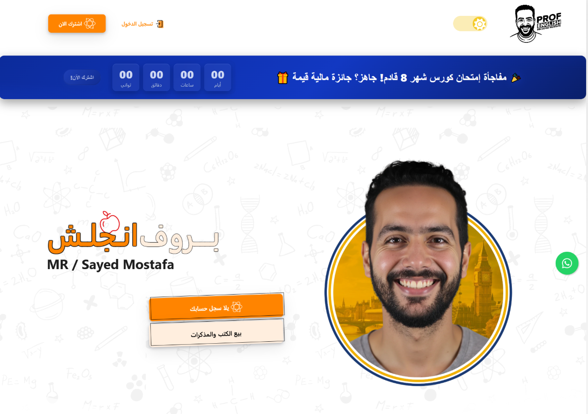

# بورتفوليو أحمد أشرف - مطور فرونت إند، خبير AI وأمن سيبراني

مرحباً بك في المستودع الرسمي لبورتفوليو أحمد أشرف! هذا المشروع يعرض مهاراتي وخبراتي كمطور فرونت إند متخصص، مع شغف عميق بالذكاء الاصطناعي (AI) والأمن السيبراني.

## من أنا؟

أنا أحمد أشرف، خريج تخصص الأمن السيبراني مع شغف كبير بتطوير التطبيقات والذكاء الاصطناعي. بدأت رحلتي بدراسة الـ AI ثم انتقلت للعمل كمدرب برمجة، وحالياً أركز على تطوير الفرونت إند باستخدام Angular.

## الميزات الرئيسية

*   **تصميم حديث ومتجاوب**: تجربة مستخدم سلسة على جميع الأجهزة.
*   **تأثيرات بصرية جذابة**: استخدام مكتبات مثل AOS و Three.js لإضفاء لمسة جمالية.
*   **محفظة أعمال منظمة**: عرض مشاريعي مقسمة حسب الفئات (بورتفوليو، صفحات هبوط، شركات، منصات تعليمية).
*   **مساعد ذكاء اصطناعي تفاعلي**: روبوت دردشة لمساعدتك في استكشاف البورتفوليو.
*   **محرر أكواد مباشر**: تجربة تفاعلية لتشغيل واختبار الأكواد مباشرة.
*   **تحسين محركات البحث (SEO)**: تحسينات لضمان ظهور أفضل في نتائج البحث.

## التقنيات المستخدمة

*   **HTML5**
*   **CSS3** (مع استخدام تصميم حديث وتأثيرات متقدمة)
*   **JavaScript** (Vanilla JS لتجربة سريعة وخفيفة)
*   **AOS (Animate On Scroll Library)**: لتأثيرات التمرير.
*   **Three.js**: لتجربة ثلاثية الأبعاد في الخلفية.

## المشاريع البارزة

### منصة تعليمية تفاعلية (Prof English)

منصة تعلم إلكتروني كاملة مع دورات فيديو واختبارات وتتبع التقدم، تميزت لعرض قدراتها القوية وميزاتها التفاعلية.

### Future Edu (صفحة هبوط)

منصة تعليمية للمساعدة في القبول الجامعي.

### موقع عقارات فاخرة (AXIOM)

موقع أنيق لعقارات فاخرة مع صور مذهلة وقوائم مفصلة.

### أجريبلوم للزراعة المستدامة (AgriBloom)

موقع مخصص لريادة الزراعة المستدامة من خلال الابتكار والتفاني.

## كيفية تشغيل المشروع محلياً

1.  **استنساخ المستودع**:
    ```bash
    git clone https://github.com/ahmedashrafibrahem/ahmedashrafibrahem.github.io.git
    ```
2.  **التنقل إلى مجلد المشروع**:
    ```bash
    cd ahmedashrafibrahem.github.io
    ```
3.  **فتح الملف `index.html`**:
    يمكنك فتح ملف `index.html` مباشرة في متصفح الويب الخاص بك.

## التواصل

*   **البريد الإلكتروني**: mnoomidoostar6@gmail.com
*   **الهاتف**: +20 102 684 3062
*   **LinkedIn**: [Ahmed Ashraf Ibrahim](https://www.linkedin.com/in/ahmedashrafibrahim1mnoomidooashraf/)
*   **GitHub**: [ahmedashrafibrahem](https://github.com/ahmedashrafibrahem)
*   **Twitter**: [mnoomidooashraf](https://twitter.com/mnoomidooashraf)

---

**© 2024 أحمد أشرف. جميع الحقوق محفوظة.**